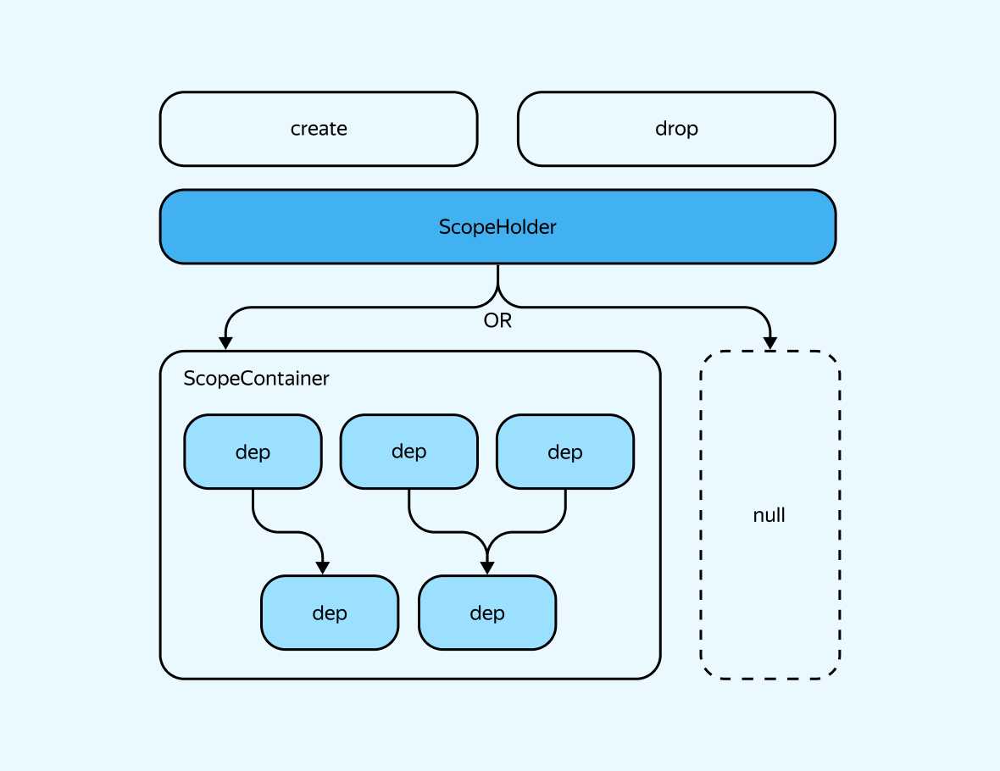
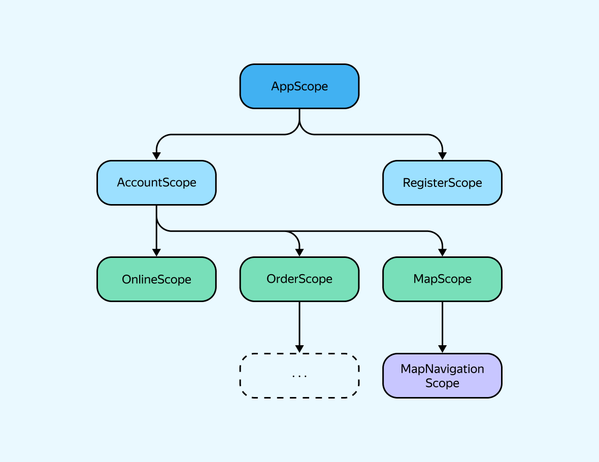
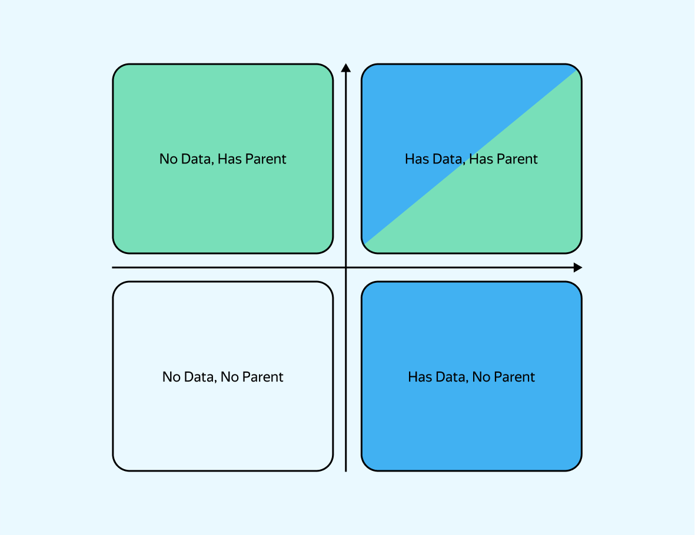

## Quick Start

Let's look at a simple dependency container. First, add yx_scope to your pubspec.yaml:

```yaml
dependencies:
    yx_scope: ^1.0.0
```

Create a file named `app_scope.dart` and add the description of our container and dependencies:

```dart
class AppScopeContainer extends ScopeContainer {
  late final routerDelegateDep = dep(() => AppRouterDelegate());

  late final appStateObserverDep = dep(
        () =>
        AppStateObserver(
          routerDelegateDep.get,
        ),
  );
}

class AppScopeHolder extends ScopeHolder<AppScopeContainer> {
  @override
  AppScopeContainer createContainer() => AppScopeContainer();
}
```

Now, let's create an `AppScopeHolder`, create a container, and access the dependencies:

```dart
void main() async {
  final appScopeHolder = AppScopeHolder();
  await appScopeHolder.create();

  final appScope = appScopeHolder.scope;
  if (appScope != null) {
    final AppStateObserver appStateObserver = appScope.appStateObserverDep.get;
  }
}
```

An important feature of the library is that we work with the DI container without binding it to the
UI. The DI container is primary, and only as an addition to this, the container can be attached to
the UI.

The DI container is created as a reaction to an event in the application's logic, not as a result of
the appearance of some screen or UI element. UI does not generate scopes; scopes generate UI.

This is an important principle of the mechanics of yx_scope.

## Key Entities

- **Dep (dependency)**: A container for one specific instance of any entity.
- **ScopeContainer**: An isolated, non-overlapping set of dependencies united by a meaningful scope
  and sharing a common lifecycle.
- **ScopeHolder**: An instance that stores the current state of the container and is responsible for
  its initialization and disposal.

> A ScopeContainer can be closed by some public interface, hiding implementation details and access
> to Dep. In this case, the interface for it will have the suffix Scope, for example, AccountScope.

`ScopeHolder` is responsible for creating and removing the scope using the `create` and `drop`
methods.

Initially, `ScopeHolder` contains a null state.

After calling the `create` method, a scope appears - a container with dependencies that can be
accessed through the `ScopeHolder`.

After the `drop` method, all scope dependencies are disposed - the `ScopeHolder` again contains
null.

Due to null-safety, `ScopeHolder` provides a compile-safe check for the existence of a scope
directly
at the time of writing code, not at runtime.



## Scope

A scope is a container with a set of dependencies, whose lifetime is limited by its life cycle. The
creation and removal of a scope occur based on specific conditions during the application's runtime,
and these **conditions and the life cycle differ from other scopes**. This is extremely
important. The fact that the logic of yx_scope revolves around the concept of a "scope" does not
mean that scopes should be created for everything. A well-structured organization of scope
hierarchies is key to making yx_scope convenient to use.

You should only create a separate scope when the life cycle of a group of dependencies has clear
conditions for both the start and end of their existence, and these conditions differ from the life
cycles of other scopes. In other words, the start of one scope may not coincide with any other, and
the end may also differ from other scopes.

> **When a Scope is Not Needed**
>
> If you're unsure what specific condition should trigger the creation of a container with a set of
> dependencies (and what specific condition should cause its termination), then creating a separate
> scope is unnecessary.
>
> If both the start and end of the life cycle of a group of dependencies coincide with those of
> another scope, there is no need to create a separate scope. Such a group of dependencies can be
> placed within an existing scope, and combined using a ScopeModule (which will be discussed later).

## Scope Tree

Scopes can relate to each other in two ways:

1. **Siblings**: Scopes at the same nesting level and in the same visibility area.
2. **Parent-child**: One scope acts as a parent, the other as a child.



In the diagram, sibling scopes are scopes of the same color.

- The purple scope is the parent for the blue ones: `Account` and `Register`.
- The blue `AccountScope` is the parent for the green scopes: `Online`, `Order`, `Map`.
- The green `MapScope` is the parent for the yellow `MapNavigationScope`.
- However, the yellow `MapNavigationScope` is not a sibling of a child scope from, for
  example, `OrderScope`, even though they are on the same level.

How to determine the relationship between two scopes? Use the following checks:

- If two groups of dependencies have different life cycles (LC) that may overlap in time in any
  order (or not overlap at all), then you need two sibling scopes.
- If two groups of dependencies have different LCs, but one can only exist strictly within the LC of
  the other, then the first scope is a child, and the second is the parent.

- `AppScope` exists for the entire life of the application.
- `AccountScope` exists within the `AppScope` and appears only when the user logs in, disappearing
  when they log out.
- `RegisterScope` exists within the `AppScope` and appears when the user goes to the registration
  page. The life cycles of `AccountScope` and `RegisterScope` do not overlap. In the future, a user
  might be able to register while already logged in, which would cause the life cycles to overlap,
  but they would still not depend on each other. Thus, they are sibling scopes.
- `OnlineScope`, `OrderScope`, and `MapScope` can only exist if the user is logged in and within
  the `AccountScope`. The life cycle of each of these three scopes is independent of the
  others: `OnlineScope` appears when the user is ready to take orders, `OrderScope` appears when the
  user has received an order, and `MapScope` appears when the user navigates to the map screen. All
  these scopes must close if the user logs out (i.e., when `AccountScope` closes).
- `MapNavigationScope` — navigation on the map can only occur when the map is open and `MapScope`
  exists. However, the map can be open without navigation, meaning the start of the life cycle
  of `MapNavigationScope` differs from that of `MapScope`. Therefore, this scope is separated.

Here's an example of how the scope tree looks in the code, based on `AppScope`:

```dart
class AppScopeContainer extends ScopeContainer {

  // The child scope of AppScope is simply a nested ScopeHolder of another scope
  late final accountScopeHolderDep = dep(() => AccountScopeHolder(this));

  late final registerScopeHolderDep = dep(() => RegisterScopeHolder(this));

  late final routerDelegateDep = dep(() => AppRouterDelegate());

  late final appStateObserverDep = dep(
        () =>
        AppStateObserver(
          routerDelegateDep.get,
          accountScopeHolderDep.get,
          registerScopeHolderDep.get,
        ),
  );
}
```

## Types of Scopes

The type of scope depends on two questions:

1. Does the scope have data without which it cannot exist?
2. Is there a scope without which the new scope cannot exist?

The combination of answers to these questions will lead us to one of four types:

- 1 No, 2 No (grey) -> ScopeContainer + ScopeHolder
- 1 Yes, 2 No (blue) -> DataScopeContainer + DataScopeHolder
- 1 No, 2 Yes (green) -> ChildScopeContainer + ChildScopeHolder
- 1 Yes, 2 Yes (green+blue) -> ChildDataScopeContainer + ChildDataScopeHolder



## ScopeModule

If the lifecycle of two groups of dependencies completely coincides, but these dependencies differ
in meaning and you want to separate them from each other, then the correct solution would be to use
`ScopeModule`.

```dart
class AppScopeContainer extends ScopeContainer {
  late final accountScopeHolderDep = dep(() => AccountScopeHolder(this));

  late final registerScopeHolderDep = dep(() => RegisterScopeHolder(this));

  // Routing entities in one module
  late final routingModule = RoutingAppScopeModule(this);
}

class RoutingAppScopeModule extends ScopeModule<AppScopeContainer> {
  RoutingAppScopeModule(super.container);

  late final routerDelegateDep = dep(() => AppRouterDelegate());

  late final appStateObserverDep = dep(
        () =>
        AppStateObserver(
          routerDelegateDep.get,
          // We can access deps from the container
          container.accountScopeHolderDep.get,
          container.registerScopeHolderDep.get,
        ),
  );
}
```

## Asynchronous Dependencies

There are dependencies that, in addition to instantiation, require additional initialization, often
asynchronous. Such dependencies are declared in a special way in the container, but most
importantly, they must be specified in the initialization queue for this scope.

```dart
class AppScopeContainer extends ScopeContainer {

  @override
  List<Set<AsyncDep>> get initializeQueue =>
      [
        {
          appStateObserverDep,
        }
      ];

  late final routerDelegateDep = dep(() => AppRouterDelegate());

  late final appStateObserverDep = rawAsyncDep(
        () =>
        AppStateObserver(
          routerDelegateDep.get,
        ),
    init: (dep) async => dep.init(),
    dispose: (dep) async => dep.dispose(),
  );
}
```

initializeQueue is an initialization queue consisting of a list of sets of dependencies. All
dependencies within the same set are initialized in parallel (simplified, this can be done via
`Future.wait([])` ([doc](https://api.dart.dev/stable/2.17.3/dart-async/Future/wait.html))).
Dependencies in different sets are initialized sequentially — first, all dependencies in the set
with the lower index in the list are initialized, followed by those in the set with the higher
index.

The initialization of the entire scope completes once all asynchronous dependencies have been
initialized. That is why the `create()` method is asynchronous.

There are two ways to make a dependency asynchronous — by using `rawAsyncDep` or by implementing the
`AsyncLifecycle` interface, which contains the init and dispose methods. To declare such a
dependency, you can use the `asyncDep` method.

The init and dispose methods, as well as their callbacks, are required to be asynchronous. This is
intentional, even for cases where a dependency can be initialized synchronously. Enforcing
asynchronous callbacks ensures that asynchronous calls inside them will not execute without await (
enforced by the `unawaited_future` lint rule).

However, if you are certain that a dependency can be initialized after the scope has already
appeared and is ready to work, you can choose not to await its initialization (ignore the linter
using `//ignore: unawaited_future`).

## Scope Interface

So far, we've been directly working with the `ScopeContainer` implementation. This is fast and
convenient, but it increases code coupling. In fact, any scope, no matter how deeply nested, can
access any other part of the scope tree through the chain. This creates highly complex and
potentially dangerous interdependencies between scopes and their dependencies.

A more flexible and scalable approach to working with scope containers is to use interfaces derived
from the base `Scope` interface. This was mentioned earlier in the "Key Entities" section.

Let's look at an example with `OnlineScope`. Recall that this scope appears when the user selects
that they are ready to receive orders in the application:

```dart
abstract class OnlineScope implements Scope {
  AcceptOrderManager get acceptOrderManager; // manager to accept incoming orders
}

class OnlineScopeContainer extends ChildScopeContainer<AccountScopeContainer>
    implements OnlineScope {

  OnlineScopeContainer({required super.parent});

  late final _acceptOrderManagerDep = dep(() =>
      AcceptOrderManager(
        parent.ordersStateHolderDep,
      ),
  );

  @override
  AcceptOrderManager get acceptOrderManager => _acceptOrderManagerDep.get;
}
```

Note: `OnlineScopeContainer` now implements the `OnlineScope` interface, which requires overriding
the getter for `AcceptOrderManager`. We implement it in the container by returning the value from
the `_acceptOrderManagerDep` container. This container can now be made private, meaning no one
outside the scope file will access it directly.

Let’s also modify the `OnlineScopeHolder`:

```dart
// Now inherits from BaseChildScopeHolder
class OnlineScopeHolder extends BaseChildScopeHolder<OnlineScope,
    OnlineScopeContainer,
    AccountScopeContainer> {
  OnlineScopeHolder(super.parent);

  @override
  OnlineScopeContainer createContainer(AccountScopeContainer parent) =>
      OnlineScopeContainer(parent: parent);
}
```

Now `OnlineScopeHolder` inherits from `BaseChildScopeHolder`. This allows us to specify the
interface as the first generic parameter. In turn, this completely hides the container from
consumers: now, when accessing `onlineScopeHolder.scope`, we will work with the `OnlineScope`
interface instead of the container itself. This completely hides the container's origin from users.

We can apply the same approach with `ScopeHolder`:

```dart
// This interface is located in the domain layer of the application
abstract class OnlineOrderStateHolder {
  Future<void> toggle();
}

class OnlineScopeHolder extends BaseChildScopeHolder<OnlineScope,
    OnlineScopeContainer,
    AccountScopeContainer>
    implements OnlineOrderStateHolder {
  OnlineScopeHolder(super.parent);

  @override
  OnlineScopeContainer createContainer(OnlineScopeParent parent) =>
      OnlineScopeContainer(parent: parent);

  @override
  Future<void> toggle() async {
    if (scope == null) {
      await create();
    } else {
      await drop();
    }
  }
}
```

In this way, in the domain layer of the application, we can work only with
the `OnlineOrderStateHolder` interface, without worrying about its implementation or the fact that
it's a `ScopeHolder`.

**Tip**: Whenever possible, always try to work with `ScopeHolder` and `ScopeContainer` through
interfaces. This will significantly reduce the coupling between your domain layer and the DI control
entities.

## Interaction Between Scopes via Interfaces

We've protected against using raw implementations of scopes from outside, but the scopes themselves
are still interconnected: `OnlineScopeContainer` knows that its parent is `AccountScopeContainer`.
This means it can access any dependency in that container, including holders of other scopes,
potentially creating implicit links between scopes from completely different parts of the tree.

However, interaction between scopes is still necessary. For example, inside `OrderScope`, we might
want to trigger navigation. Somehow, we need to link scopes across different levels and parents.
This can be done through the parent's `Scope` interface.

Let’s continue the example with `OnlineScope`:

```dart
abstract class OnlineScope implements Scope {
  AcceptOrderManager get acceptOrderManager;
}

/// Interface describing what entities the parent must contain
/// to satisfy the expectations of the child scope
abstract class OnlineScopeParent implements Scope {
  OrderStateHolder get orderStateHolder;
}

/// Now ChildScopeContainer is typed not with AccountScopeContainer,
/// but with the interface expected from the parent
class OnlineScopeContainer extends ChildScopeContainer<OnlineScopeParent>
    implements OnlineScope {

  // Dependencies
}

/// ScopeHolder is also typed with OnlineScopeParent
class OnlineScopeHolder extends BaseChildScopeHolder<OnlineScope,
    OnlineScopeContainer,
    OnlineScopeParent>
    implements OnlineOrderStateHolder {
  // Implementation
}
```

Now `OnlineScope` becomes truly independent. Its consumers use the `OnlineScope` interface, and it
only knows the necessary minimum about its parent to function.

To ensure that the parent scope meets the required contract, we must implement it:

```dart
class AccountScopeContainer extends ChildDataScopeContainer<AccountScopeParent, Account>
    implements AccountScope, OnlineScopeParent {
  AccountScopeContainer({
    required super.parent,
    required super.data,
  });

  late final _onlineScopeHolderDep = dep(() => OnlineScopeHolder(this));

  late final _orderScopeHolderDep = dep(() => OrderScopeHolder(this));

  late final _mapScopeHolderDep = dep(() => MapScopeHolder());

  @override
  OrderStateHolder get orderStateHolder => _orderScopeHolderDep.get;
}
```

Here, `AccountScopeContainer` implements both its own `AccountScope` interface and
the `OnlineScopeParent` interface.

**Tip**: Do not return parent scopes transitively down through interfaces. `OnlineScopeParent`
should not contain a getter for `AccountScopeParent`. This would break isolation by forcing the
scope to implicitly know about the parent's implementation. If you need entities from
the `AccountScopeParent` parent scope, declare them explicitly in the `OnlineScopeParent` interface.

The benefits of this additional boilerplate is that If all scopes are strictly organized according
to the rule of using interfaces, you can change the hierarchy of your scope tree almost painlessly.
This is crucial in a growing product, as the requirements and life cycles of various app flows may
inevitably change. When moving a child scope from one parent to another, you’ll only need to modify
those parent scopes. The child scope itself will remain unchanged.

## In the Widget Tree

The core of `yx_scope` is pure Dart, but the scopes are designed to integrate with Flutter widgets.
For this, you can use the `yx_scope_flutter` package, which provides a set of widget adapters for
your `ScopeHolder` objects.

Here's a basic example of how to inject a root scope into the widget tree:

```dart
class App extends StatefulWidget {
  const App({super.key});

  @override
  State<App> createState() => _AppState();
}

class _AppState extends State<App> {
  final _appScopeHolder = AppScopeHolder();

  @override
  void initState() {
    super.initState();
    _appScopeHolder.create();
  }

  @override
  void dispose() {
    _appScopeHolder.drop();
    super.dispose();
  }

  @override
  Widget build(BuildContext context) {
    return ScopeProvider(
      holder: _appScopeHolder,
      // Scope widgets support working with Scope interfaces
      child: ScopeBuilder<AppScopeContainer>.withPlaceholder(
        builder: (context, appScope) {
          return MaterialApp.router(
            title: 'YxScopedFlutter Demo',
            routerDelegate: appScope.routerDelegateDep.get,
          );
        },
        // Displays this widget while [appScopeHolder] is loading
        placeholder: const Center(child: CircularProgressIndicator()),
      ),
    );
  }
}
```

Notice that `AppScopeHolder` is a field inside the `State` of your app. This is one of the most
significant advantages of `yx_scope`: the entire scope tree (i.e., your whole DI) consists of
non-static `ScopeHolder` instances that are localized to their place in the tree. The
root `ScopeHolder` instance only exists where you instantiate it, and any child `ScopeHolder`
instance only exists if its direct parent scope exists. In some sense, you could call this a
*hyper-local* scoping system.

## Static Analysis

Another essential part of `yx_scope` is a set of static analysis rules to guide best practices when
working with the framework. To use it, add the following to your `pubspec.yaml`
under `dev_dependencies`:

```yaml
dev_dependencies:
    yx_scope_linter: ^1.0.0
    custom_lint: ^0.5.3
```

Then, run `pub get`. After that, add this to your `analysis_options.yaml`:

```yaml
analyzer:
    plugins:
        - custom_lint
```

With this setup, the linter will remind you to add the `Dep` suffix, declare fields as `final`,
highlight uninitialized asynchronous dependencies, detect cyclic dependencies without any code
generation, and even show the full list of entities involved in the cycle.

This isn't a comprehensive set of rules yet. You can find the current list in the `yx_scope_linter`
README.md. Manual rules not yet automated can be found in `docs/manual_linter.md`, and we’ll
gradually automate them over time.

---

We've now covered the fundamental principles of how the `yx_scope` library works, from global
container basics to scope separation via interfaces and how to link scopes together.

You can find a more detailed [app example](../example) using scopes in the `yx_scope_flutter`
repository. It also includes an example of creating dynamic scopes of the same type, such
as `OrderScope` for handling multiple orders.

If you're interested in the issues and motivations behind creating `yx_scope`, check out the [Dev
Day/Night](https://www.youtube.com/watch?v=3hcDcdfk0pQ&list=PLQC2_0cDcSKD7Bfrg0U36Q2KDiy9dLdmb) (ru)
conference talk. Note that the talk covers an earlier version of the library, where it was
called `yx_scoped` and `ScopeContainer` was called `ScopeNode`—don’t let that confuse you.
